# Proyecto Open Project Angel Cantero

## Documentación inicial de OpenProject
### Parte básica
- OpenProject, es en resumidas cuentas, un Software de gestión de proyectos de código abierto que puede instalarse directamente en la infraestructura de tu organización. Esto te permite tener el control completo sobre tus datos. Su naturaleza de código abierto te permite ver,modificar y utilizar su código fuente.
- A continuación se mostrará un listado con las funciones que te permite realizar OpenProject:
  
  1. Gestión de proyectos: crear una estructura de proyectos con jerarquías,opción de favoritos,supervisión del estado de los proyectos y todo esto ya sea para una gestión de proyectos clásica ,Agile o híbrida.
   
  2. Programación y planificación de dichos proyectos: programar y planificar de forma colaborativa tanto los objetivos,los tiempos de entrega como las prioridades de tus proyectos.
   
  3. Gestión de tareas y seguimiento de incidencias: realizar una organización de las tareas con su respectivos miembros y los resultados de estos mismos todo en un mismo lugar.
   
  4. Compatibilidad con proyectos Agile: hacer uso de metodologías Agile como KANBAN o SCRUM.
   
  5. Seguimiento del tiempo, informes de costes y presupuestos: hacer un seguimiento de los costes de producción,tiempo invertido,rendimiento,recursos asignados y comprobar cuánto se ha usado del presupuesto establecido.
   
  6. Colaboración en equipo: facilidad de colaboración en equipo con un fácil acceso a los datos, a la comunicación o compartir información.
   
  7. Hoja de ruta del producto y planificación de lanzamientos: compartir de forma sencilla y transparente la hoja de ruta con todas las partes que intervienen en el producto.
   
  8. Flujos de trabajo y personalización: disfrutar de una amplia capacidad de personalización según los gustos o necesidades de su organización. 

- Como se explica en uno de los puntos del apartado anterior el acceso al entorno gráfico de OpenProject se realiza mediante el navegador Web, facilitando asi la interacción de los usuarios permitiendoles gestionar todas las opciones que proporciona OpenProject.  

### Parte técnica

- La API REST permite la comunicación entre sistemas informáticos siguiendo los principios de la arquitectura REST(Representational State Transfer), la cual se basa en solicitudes que utilizan el protocolo HTTP(GET, POST, PUT, DELETE, etc.).
- 
- Mostraremos brevemente algunos ejemplos de la base de datos la cual es bastante extensa :

Este es un ejemplo de una de la muchisimas tablas, con sus respectivas columnas, que podemos encontrar en la base de datos de OpenPropject.
Podemos observar la diversidad de tablas,columnas y demas especificaciones de cada tabla de manera sencilla mediante pgAdmin.
Como hemos comentado en la primera reunión deberemos dedicarle tiempo a entender la estructura y a los datos a introducir ya que en ocasiones será mejor realizar las consultas desde la base de datos que desde la API.

- En este caso el motor utilizado para la gestión de la base de datos es PostgreSQL ,conocido por ser fiable,flexible y potente. Ademas nos permite trabajar con datos mas complejos como archivos JSON.
La continua actualización y la gran comunidad que tiene la hace muy segura. 

- A la hora de desplegar OpenProject en local tenemos diversas opciones que podemos encontrar explicadas en la pagina Web:
  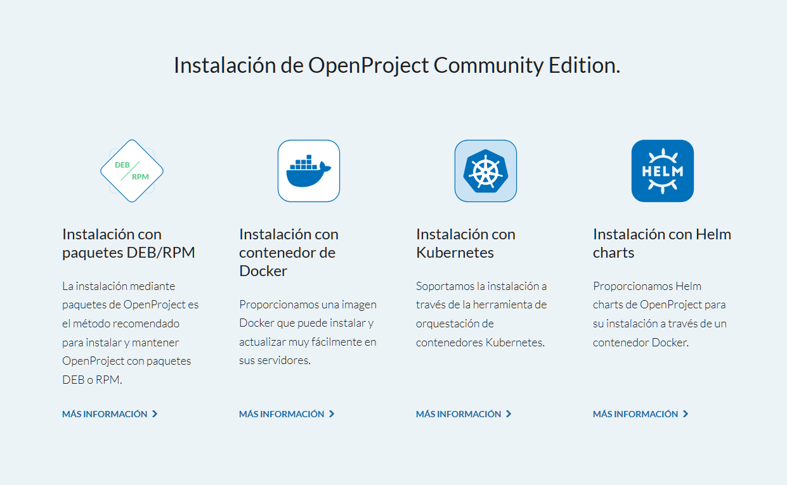
  En nuestro caso decidimos realizar la instalación mediante Docker.
  Buscamos en Docker hub la imagen de OpenProject elegimos la versión 15 realizamos el pull y una vez estaba todo listo simplemente le dimos a **RUN** en la aplicacion de Docker.
  Todo esto no fué tan simple en realidad ya que según los navegadores o equipos en los que lo hacíamos surgian diferentes problemas.
  Todo esto lo explicaremos con mas detalle en el siguiente punto.

## Despliegue en local de Open Project
- En un principio utilizamos la interfaz gráfica y el buscador de docker para arrancar OpenProject de manera rapida y sencilla, pero mas tarde nos encontrariamos con un problema ya que  necesitaríamos extraer el puerto 5432(el cual usa por defecto PostgreSQL) con uno del propio ordenador con el fin de acceder a la base de datos desde nuestra maquina para ello copiamos el comando facilitado en la pagina de OpenProject y le añadimos **-p 8081:5432** que le dice a docker que quieres hacer accesible el puerto 5432 desde el puerto 8081.
Esto último se puede hacer desde docker en algunas versiones recientes.

- Una vez el contenedor listo lo iniciamos lo cual nos abrirá una ventana en nuestro navegador con la plataforma de OpenProject en el local host.
  
  A veces muestra un error que se soluciona cambiando la ruta y poniendo localhost.
  
  Una vez dentro ingresamos con el usuario admin y contraseña admin, la cual nos hará cambiar al instante de hacer el login.
  Y ahora ya podemos empezar a utilizar nuestro OpenProject privado.

## Introducción de datos
Una vez creada la instancia hemos introducido una serie de datos mediante la intefaz grafica que proporciona OpenProject.
### Ejemplos
- Creacion de usuario
  

- Creacion de grupos
  

- Asignacion de miembros/usuarios a un grupo

- Creación de proyecto

- Asignación de grupo y roles a un proyecto

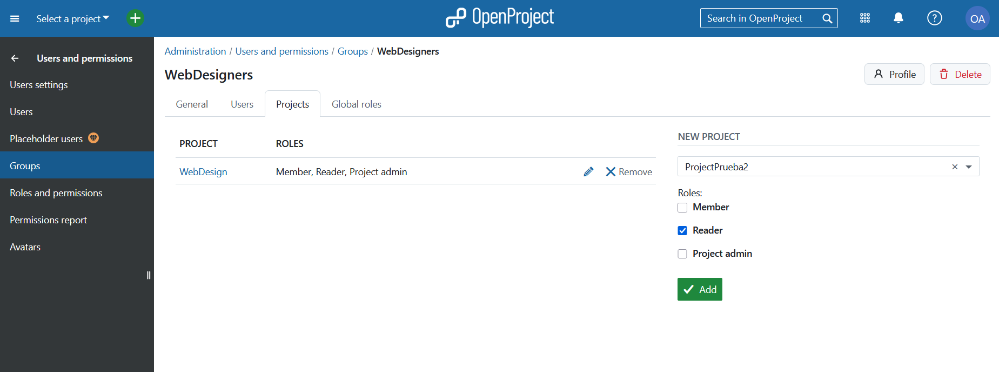  

### Ejemplos con pgAdmin4
Para estos ejemplos el proceso ha sido sacar mediante las herramientas de pgadmin el insert preparado para introducir datos y ver que datos usa la tabla poner los datos correspondientes

  
En este tuve que buscar como introducir un jsonb vacío.

 

Este seria un ejemplo de lo dicho anteriormente para introducir de manera sencilla datos a la base mediante pgAdmin.
A continuación una prueba de introducción de usuario desde pgadmin.
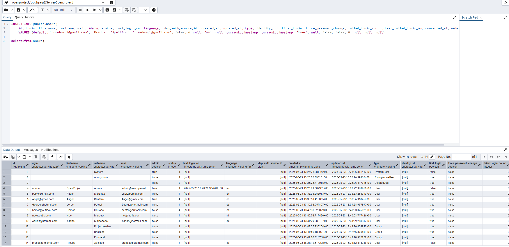
Como no es necesario lo dejaremos por aquí para no malgastar el tiempo pero hemos comprobado y puesto en práctica el funcionamiento para introducir datos mediante solicitudes.

## Práctica con peticiones
1. **PARTE 1 - CRUD Básico de Proyectos**
   **SQL**
   1. Lista todos los proyectos 
   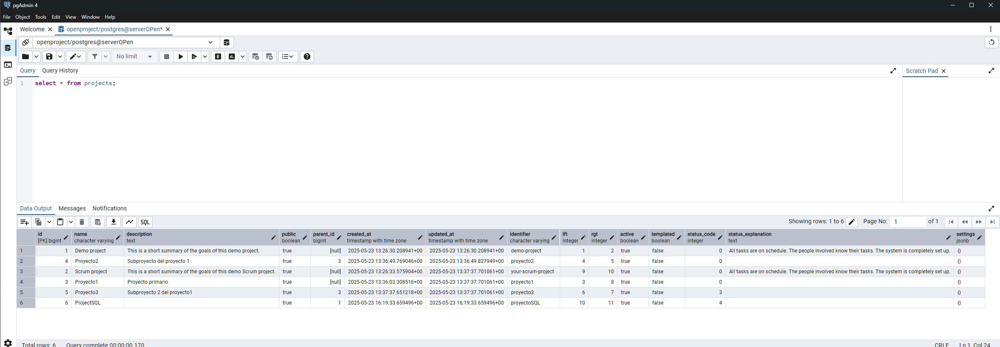
   2. Crea un proyecto llamado “Proyecto de Prueba”
   
   3. Obtén los detalles del proyecto que acabas de crear.
   
   
   4. Cambia el nombre del proyecto creado en el punto anterior a “Proyecto Editado”
   
   5. Elimina el proyecto creado.
   
   6. **Extra  Lista todos los usuarios de Open Project**
      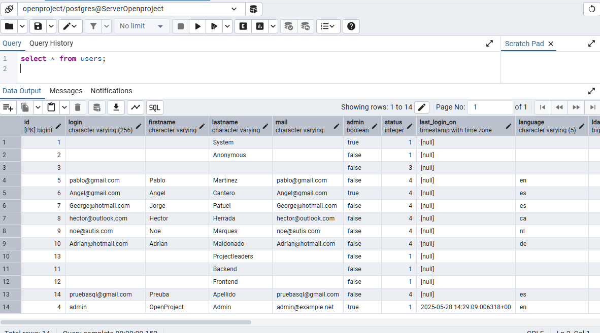

   **Llamada a la API**
   1. Lista todos los proyectos.
   
   2. Crea un proyecto llamado “Proyecto de Prueba”
   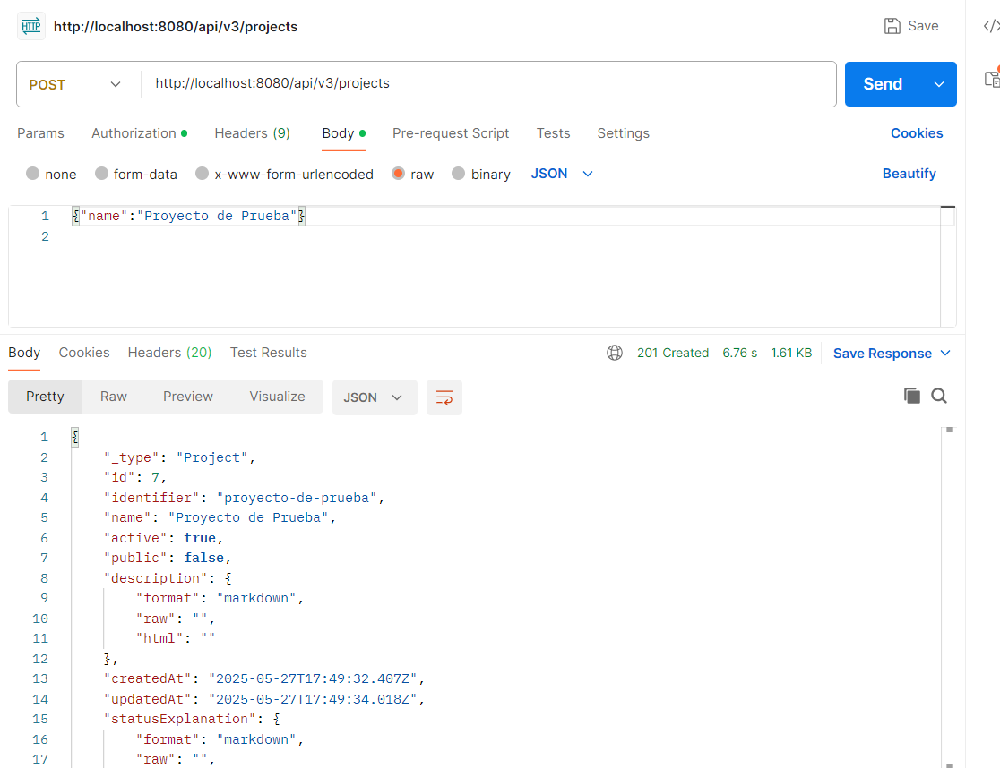
   3. Obtén los detalles del proyecto que acabas de crear.
   
   4. **Cambia el nombre del proyecto creado en el punto anterior a “Proyecto Editado”**
   
   5. Elimina el proyecto creado.
   
   6. **Extra  Lista todos los usuarios de Open Project**
      
      
 2. **PARTE 2 - Consultas Ordenadas**
   **SQL**
   1. Lista los proyectos ordenados por fecha de creación (de viejo a nuevo)
   
   2. Lista los proyectos ordenados por fecha de edición (de nuevo a viejo)
   
   3. Lista los proyectos ordenados por orden alfabético
   
   
   **Llamada a la API**
   1. Lista los proyectos ordenados por fecha de creación (de viejo a nuevo)
   
   2. Lista los proyectos ordenados por fecha de edición (de nuevo a viejo)
   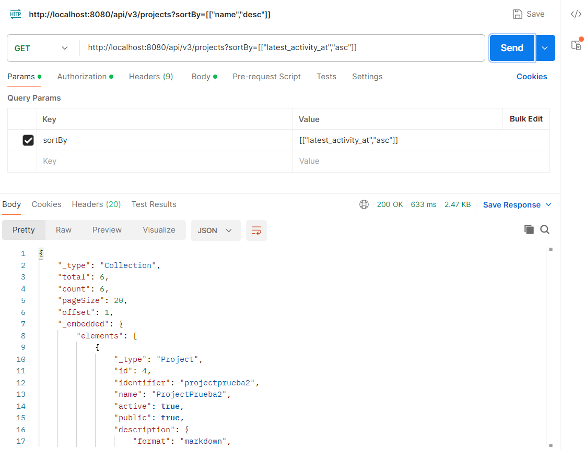
   3. Lista los proyectos ordenados por orden alfabético
   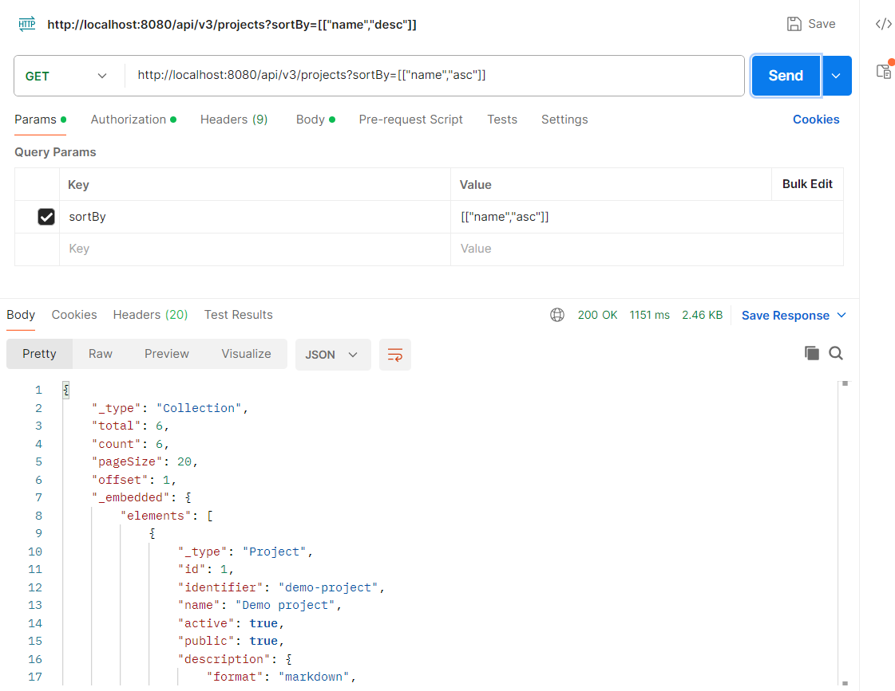

3. **PARTE 3 – Consultas con Filtros**
   **SQL**
   1. Crea un proyecto llamado “Proyecto 1”.
   
   2. Lista todos los proyectos llamados “Proyecto 1”.
   
   3. Crea un par de tareas
   
   
   4. Lista todas las tareas activas
   
   5. Lista todas las tareas creadas desde antes del 30 de mayo de 2025
   
   6. Lista todas las tareas inactivas creadas después del 20 de mayo
   

- Como no sabia si con activo e inactivo se referia al status o las fechas de comienzo y finalización lo he hecho de ambas formas y así poder ver distintas formas. 

   **Llamada a la API**
   1. Crea un proyecto llamado “Proyecto 1”.
   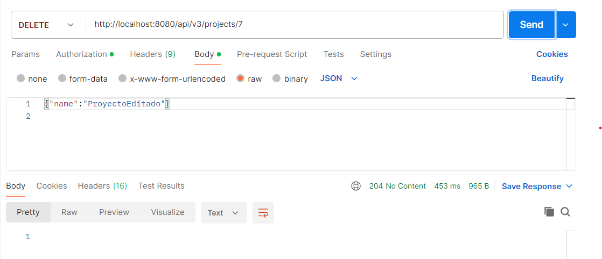
   2. Lista todos los proyectos llamados “Proyecto 1”.
   
   3. Crea un par de tareas
   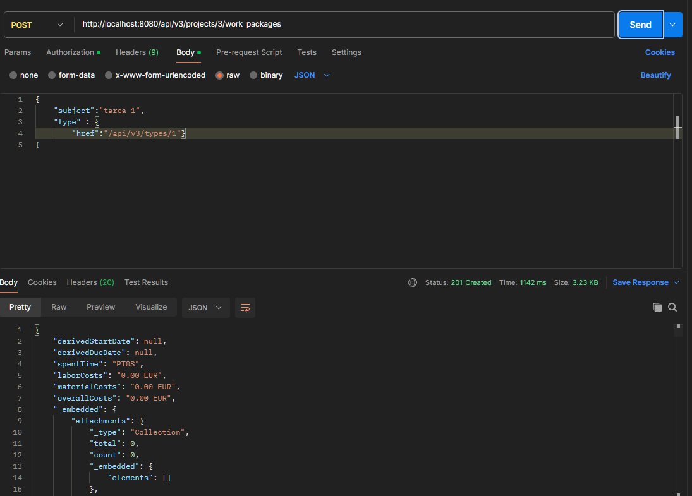
   
   4. Lista todas las tareas activas
   
   - Para estos 2 ultimos hubo que hacer uso de operadores distintos a los que deberian ya que solo se puede comprobar si esta entre dos fechas, o si es la fecha exacta
   5. Lista todas las tareas creadas desde antes del 30 de mayo de 2025
   
   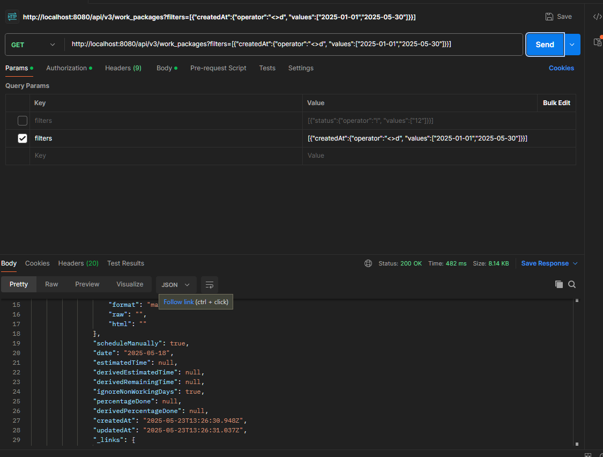
   6. Lista todas las tareas inactivas creadas después del 20 de mayo
   
    
      
   

## Repositorio en Github

## Desarrollo de la pagina Web