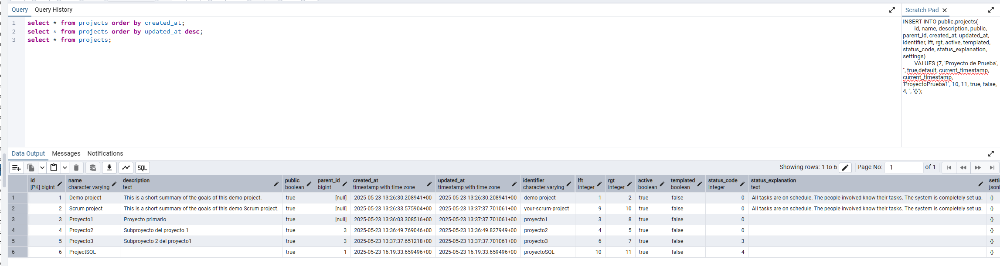
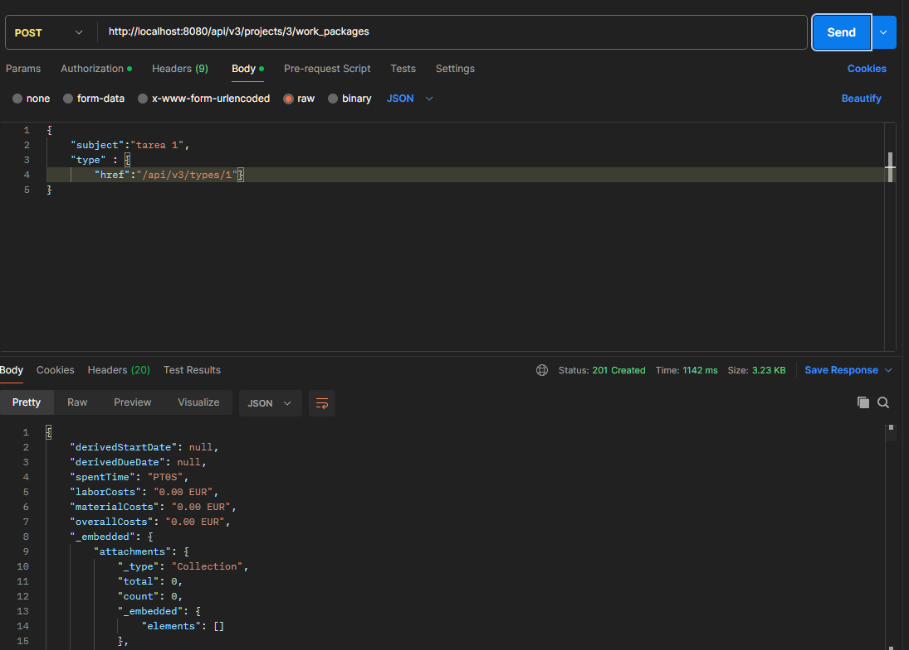
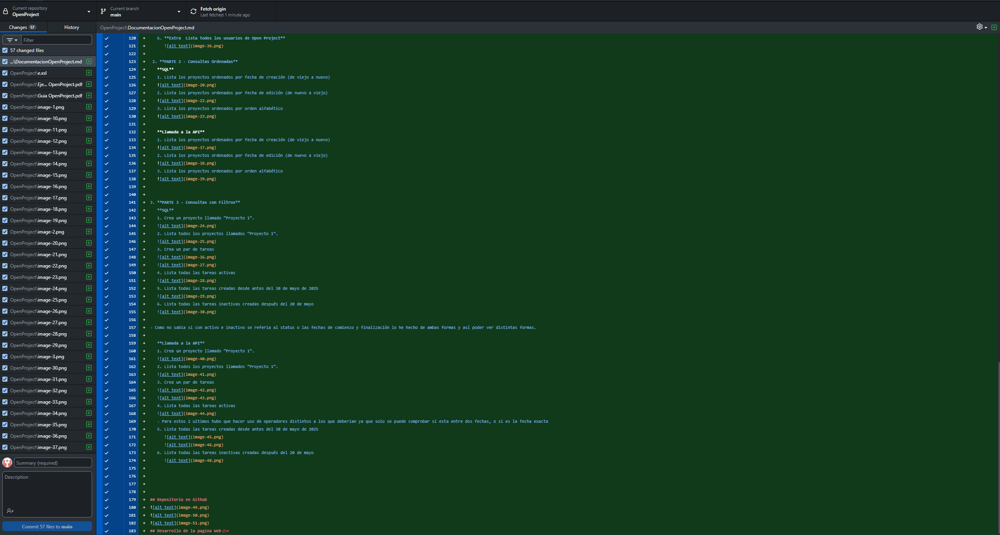
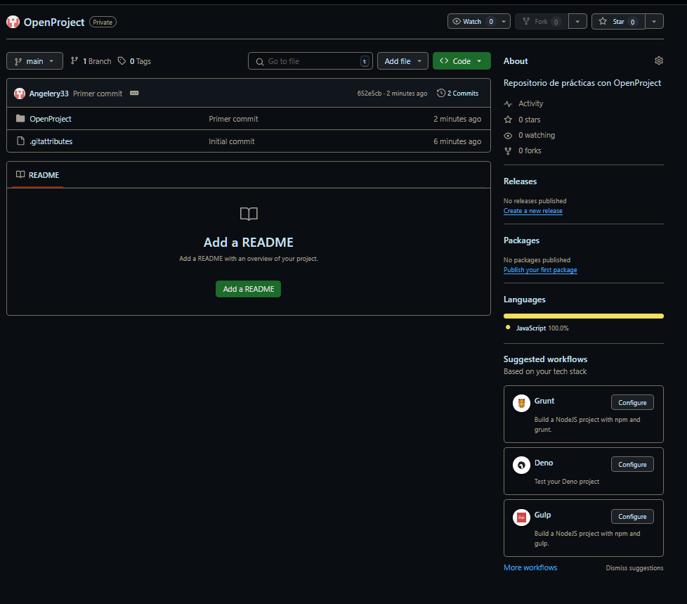

# Proyecto Open Project Angel Cantero
---

## Documentación inicial de OpenProject
### Parte básica
- OpenProject, es en resumidas cuentas, un Software de gestión de proyectos de código abierto que puede instalarse directamente en la infraestructura de tu organización. Esto te permite tener el control completo sobre tus datos. Su naturaleza de código abierto te permite ver,modificar y utilizar su código fuente.
- A continuación se mostrará un listado con las funciones que te permite realizar OpenProject:
  
  1. Gestión de proyectos: crear una estructura de proyectos con jerarquías,opción de favoritos,supervisión del estado de los proyectos y todo esto ya sea para una gestión de proyectos clásica ,Agile o híbrida.
   
  2. Programación y planificación de dichos proyectos: programar y planificar de forma colaborativa tanto los objetivos,los tiempos de entrega como las prioridades de tus proyectos.
   
  3. Gestión de tareas y seguimiento de incidencias: realizar una organización de las tareas con su respectivos miembros y los resultados de estos mismos todo en un mismo lugar.
   
  4. Compatibilidad con proyectos Agile: hacer uso de metodologías Agile como KANBAN o SCRUM.
   
  5. Seguimiento del tiempo, informes de costes y presupuestos: hacer un seguimiento de los costes de producción,tiempo invertido,rendimiento,recursos asignados y comprobar cuánto se ha usado del presupuesto establecido.
   
  6. Colaboración en equipo: facilidad de colaboración en equipo con un fácil acceso a los datos, a la comunicación o compartir información.
   
  7. Hoja de ruta del producto y planificación de lanzamientos: compartir de forma sencilla y transparente la hoja de ruta con todas las partes que intervienen en el producto.
   
  8. Flujos de trabajo y personalización: disfrutar de una amplia capacidad de personalización según los gustos o necesidades de su organización. 

- Como se explica en uno de los puntos del apartado anterior el acceso al entorno gráfico de OpenProject se realiza mediante el navegador Web, facilitando asi la interacción de los usuarios permitiendoles gestionar todas las opciones que proporciona OpenProject.  

### Parte técnica

- La API REST permite la comunicación entre sistemas informáticos siguiendo los principios de la arquitectura REST(Representational State Transfer), la cual se basa en solicitudes que utilizan el protocolo HTTP(GET, POST, PUT, DELETE, etc.).
- Mostraremos brevemente algunos ejemplos de la base de datos la cual es bastante extensa :

Este es un ejemplo de una de la muchisimas tablas, con sus respectivas columnas, que podemos encontrar en la base de datos de OpenPropject.
Podemos observar la diversidad de tablas,columnas y demas especificaciones de cada tabla de manera sencilla mediante pgAdmin.
Como hemos comentado en la primera reunión deberemos dedicarle tiempo a entender la estructura y a los datos a introducir ya que en ocasiones será mejor realizar las consultas desde la base de datos que desde la API.

- En este caso el motor utilizado para la gestión de la base de datos es PostgreSQL ,conocido por ser fiable,flexible y potente. Ademas nos permite trabajar con datos mas complejos como archivos JSON.
La continua actualización y la gran comunidad que tiene la hace muy segura. 

- A la hora de desplegar OpenProject en local tenemos diversas opciones que podemos encontrar explicadas en la pagina Web:

  

  En nuestro caso decidimos realizar la instalación mediante Docker.
  Buscamos en Docker hub la imagen de OpenProject elegimos la versión 15 realizamos el pull y una vez estaba todo listo simplemente le dimos a **RUN** en la aplicacion de Docker.
  Todo esto no fué tan simple en realidad ya que según los navegadores o equipos en los que lo hacíamos surgian diferentes problemas.
  Todo esto lo explicaremos con mas detalle en el siguiente punto.

---
## A lo largo de la práctica se veran distintas interfaces y datos debido al uso de dos ordenadores distintos.  
---

## Despliegue en local de Open Project

- En un principio utilizamos la interfaz gráfica y el buscador de docker para arrancar OpenProject de manera rapida y sencilla, pero mas tarde nos encontrariamos con un problema ya que  necesitaríamos extraer el puerto 5432(el cual usa por defecto PostgreSQL) con uno del propio ordenador con el fin de acceder a la base de datos desde nuestra maquina para ello copiamos el comando facilitado en la pagina de OpenProject y le añadimos **-p 8081:5432** que le dice a docker que quieres hacer accesible el puerto 5432 desde el puerto 8081.
Esto último se puede hacer desde docker en algunas versiones recientes.

- Una vez el contenedor listo lo iniciamos lo cual nos abrirá una ventana en nuestro navegador con la plataforma de OpenProject en el local host.

  

  A veces muestra un error que se soluciona cambiando la ruta y poniendo localhost.

  

  Una vez dentro ingresamos con el usuario admin y contraseña admin, la cual nos hará cambiar al instante de hacer el login.
  Y ahora ya podemos empezar a utilizar nuestro OpenProject privado.

## Introducción de datos

Una vez creada la instancia hemos introducido una serie de datos mediante la intefaz gráfica que proporciona OpenProject.

### Ejemplos
- Creacion de usuario
  

- Creacion de grupos
  

- Asignación de miembros/usuarios a un grupo

- Creación de proyecto

- Asignación de grupo y roles a un proyecto

  

### Ejemplos con pgAdmin4
Para estos ejemplos el proceso ha sido sacar mediante las herramientas de pgadmin el insert preparado para introducir datos y ver que datos usa la tabla poner los datos correspondientes

  
En este tuve que buscar como introducir un jsonb vacío.

 

Este sería un ejemplo de lo dicho anteriormente para introducir de manera sencilla datos a la base mediante pgAdmin.
A continuación una prueba de introducción de usuario desde pgadmin.

Como no es necesario lo dejaremos por aquí, pero hemos comprobado y puesto en práctica cómo introducir datos mediante solicitudes.

---
## Práctica con peticiones

**En esta sección ha sido mucho mas fácil familiarizarse con pgAdmin y postrgreSQL. Esto se debe a que durante el curso hemos utilizado de forma constante MySQL, sin embargo JavaScript y JSON me ha resultado mucho más desafiante.**

 **Por ello explicaré en mayor medida aquellas que me han costado mas realizar.**

1. **PARTE 1 - CRUD Básico de Proyectos**
   
   **SQL**

   - En estos primeros ejercicios la única complicación que encontre fué como insertar un objeto jsonb,por lo demás son consultas mediante select e insert into, filtrados mediante where y cambios y eliminaciones mediante update y delete.
  

   1. **Lista todos los proyectos**
   

   2. **Crea un proyecto llamado “Proyecto de Prueba”**
   

   3. **Obtén los detalles del proyecto que acabas de crear.**
   
   

   4. **Cambia el nombre del proyecto creado en el punto anterior a “Proyecto Editado”**
   

   5. **Elimina el proyecto creado.**
   

   6. **Extra  Lista todos los usuarios de Open Project**
      
   ---
   
   **Llamada a la API**
   - Tener en cuenta que en la sección de autorizacion de postman habremos incluido una basic auth,con nombre de usuario apikey y el token que generemos en nuestro openproject.
  
   - En cuanto a la Api, mediante Postman estos primeros ejercicios tambien han resultado ser fáciles haciendo uso de la pagina https://www.openproject.org/docs/api/endpoints/projects/ ,esta por ejemplo, a la hora de realizar consultas sobre projects.
  
   1. **Lista todos los proyectos.(GET, ruta a projects)**
   

   2. **Crea un proyecto llamado “Proyecto de Prueba” (POST, ruta a projects,body:json que incluye el nombre)**
   

   3. **Obtén los detalles del proyecto que acabas de crear.(GET, ruta a projects mas el id del proyecto)**
   

   4. **Cambia el nombre del proyecto creado en el punto anterior a “Proyecto Editado” (PATCH, ruta a projects/id, body:nombre nuevo)**
   

   5. **Elimina el proyecto creado. (DELETE, ruta a projects+id)**
   

   6. **Extra  Lista todos los usuarios de Open Project (GET, ruta a users)**
      
 ---
 1. **PARTE 2 - Consultas Ordenadas**
   
   **SQL**

   - En los siguientes ejercicios simplemente realizaremos consultas simples utilizando order by para ordenar y **asc** y **desc** para determinar la dirección.
  
     1. **Lista los proyectos ordenados por fecha de creación (de viejo a nuevo)**
    

     2. **Lista los proyectos ordenados por fecha de edición (de nuevo a viejo)**
    

     3. **Lista los proyectos ordenados por orden alfabético**
    

 ---  
   **Llamada a la API**
   - Aqui empezo a complicarse un poco ya que nos costó más identificar en la web mencionada anteriormente como realizar los filtros requeridos. Con la ayuda de un compañero (Adrian) pudimos ver mejor como funcionaba y que estructura requerida.
   - Primero lo escribimos manualmente pero luego vimos que se pueden escribir los filtros en la tabla de query params poniendo el tipo en un lado y los valores a comparar/filtrar al otro.De esta manera, se coloca automáticamente  en la ruta los filtros correspondientes. 
   - Uno de los problemas que encontramos fue que se necesita hacer uso de **?** en la ruta ,al introducirlo en query params se coloca automáticamente el símbolo.
  
     1. **Lista los proyectos ordenados por fecha de creación (de viejo a nuevo)(GET, ruta a projects,sortBy,valor :createdAt,orden:desc)**
      

     2. **Lista los proyectos ordenados por fecha de edición (de nuevo a viejo)(GET, ruta a projects,sortBy,valor :latest_activity_at,orden:desc)**
      

     3. **Lista los proyectos ordenados por orden alfabético (GET, ruta a projects,sortBy,valor :name,orden:asc)**
      

---
3. **PARTE 3 – Consultas con Filtros**
   
   **SQL**

   - En estos últimos solo hubo que observar los datos de las tablas que hicieran falta(work_packages),filtro de los campos status_id,created_at y start_date.

   1. **Crea un proyecto llamado “Proyecto 1”.**
   

   2. **Lista todos los proyectos llamados “Proyecto 1”.**
   

   3. **Crea un par de tareas**
   
   

   4. **Lista todas las tareas activas**
   

   5. **Lista todas las tareas creadas desde antes del 30 de mayo de 2025**
   

   6. **Lista todas las tareas inactivas creadas después del 20 de mayo**
   

- Como no sabia si con activo e inactivo se refería al status o las fechas de comienzo y finalización lo he hecho de ambas formas para poder observar distintos enfoques. 
---
   **Llamada a la API**

   - En esta parte de llamadas a la Api hubo que buscar como usar los filtros y con que campos y en que formato, sobre todo el 5 y el 6 que generaron mas problemas.

     1. **Crea un proyecto llamado “Proyecto 1”.**
   

     2. **Lista todos los proyectos llamados “Proyecto 1”. (GET, ruta a projects,filters,clave:name,operator:=,valor:proyecto1)**
   

     3. **Crea un par de tareas**
   
   

     4. **Lista todas las tareas activas (GET, ruta a work_packages,filters,clave:status,operator:!,valor:12)valor 12 es el id de status Terminado**
   

   - Para estos 2 últimos hubo que hacer uso de operadores distintos a los que deberían usarse ya que solo se puede comprobar si esta entre dos fechas, o si es la fecha exacta
  
     5. **Lista todas las tareas creadas desde antes del 30 de mayo de 2025 (GET, ruta a work_packages,filters,clave:createdAt,operator:<>d,valor:2025-01-01 y 2025-05-30)este operador busca entre esas dos fechas**
   
   

     6. **Lista todas las tareas inactivas creadas después del 20 de mayo (GET, ruta a work_packages,filters,clave:createdAt,operator:<>d,valor:2025-05-20 y 2025-05-30)&(filters,clave:status,operator:=,valor:12)buscando que este entre el 20 y la fecha actual en el momento de la captura y que ademas este finalizada**
   
    
      
   
---
## Repositorio en GitHub
- Para hacer uso de GitHub he decidido usar la interfaz de GitHub Desktop que aun siendo la primera vez que la usamos, durante el curso usamos la terminal, resulta muy fácil de usar.
- Haré una breve descripción de los pasos realizados en cada captura.
  
  

**Creación del repositorio.**

  
  

**Publicación del mismo en GitHub**

  

**Vemos como la interfaz nos muestra detalladamente todos los cambios realizados los cuales confirmaremos en local mediante el commit que podemos hacer abajo a la izquierda de la ventana de manera sencilla.**

**Hacemos un push con el commit que aun no se enccuentra en GitHub**

**Y ya tenemos nuestro repositorio en GitHub actualizado en unos pocos y sencillos pasos.**

**Comprobamos que se pueda colaborar por parte de los demas usuarios y hacemos publico nuestro repositorio desde GitHub**.

---

## Desarrollo de la pagina Web

En cuanto a la página Web he optado por realizar 2,una más rudimentaria basada en algunos conocimientos que he adquirido en la última semana ,ayuda de compañeros y profesores y lo estrictamente necesario de IA una vez no encontraba la solución, por otro lado la segunda página he querido intentar descrubir con ayuda de la IA y compañeros mas avanzados que cosas podía hacer con JavaScript.

En cuanto a JavaScript diría que es un lenguaje que puedo entender en cierta medida debido a la semejanza con Java, pero a su vez las funciones utilizadas han sido totalmente nuevas al combinar HTML y JavaScript.

HTML y CSS han sido relativamente fáciles, ya que les hemos dedicado bastante tiempo durante el curso, por ello he intentado recrearme todo lo posible en cuanto a estilos, sin excederme en cuanto a tiempo utilizado.

En definitiva el resultado han sido 2 páginas web similares pero con scripts distintos.

En la Web "Principal" después de la última reunión la he actualizado para insertar directamente desde el script la tabla al DOM como me recomendaron,con un vídeo de YouTube fue relativamente sencillo dado que la mayoría ya lo tenía hecho solo tenia que crear los elementos que faltaban e insertarlos al HTML directamente. En la carpeta draft se encuentra como estaba el script antes de estos cambios.

En la Web Secundaria ya hay uso de botones, filtrado según los datos que se introducen, URLs e información más difícil de acceder.

El aspecto es compartido por ambas mediante el mismo css.

- Página Principal

- Página de pruebas

--- 
### Bibliografía

- [https://www.openproject.org/](https://www.openproject.org/)
- [https://www.openproject.org/docs/api/endpoints/](https://www.openproject.org/docs/api/endpoints/)
- [https://www.ibm.com/es-es/think/topics/rest-apis](https://www.ibm.com/es-es/think/topics/rest-apis)
- [https://www.youtube.com/watch?v=MKzHruwcNOQ](https://www.youtube.com/watch?v=MKzHruwcNOQ)
- [https://www.youtube.com/watch?v=Z34BF9PCfYg](https://www.youtube.com/watch?v=Z34BF9PCfYg)
- [https://www.youtube.com/watch?v=1glVfFxj8a4](https://www.youtube.com/watch?v=1glVfFxj8a4)

--- 
### Otros recursos utilizados
- Información de otros compañeros y profesores.
- Tutoriales propios de las aplicaciones como Docker,Github Desktop,etc...
- IA para la busqueda de información,erratas o problemas.
- Codigo reciclado del curso. 

---
#### Dejo el documento en markdown ya que la exportación a pdf de markdown deja mucho que desear.